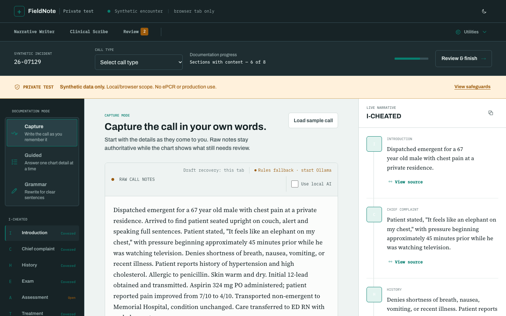
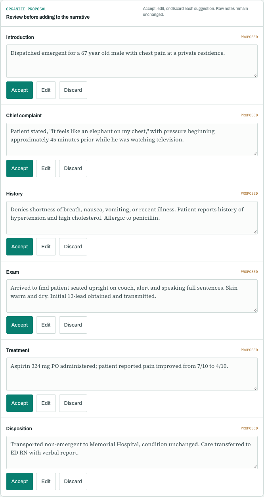
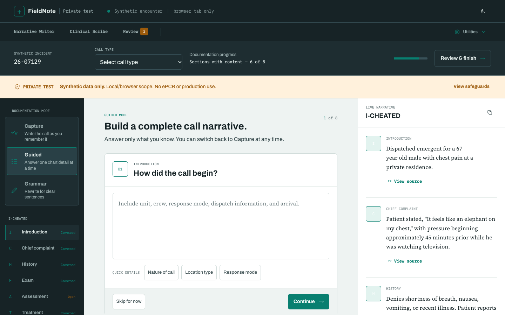
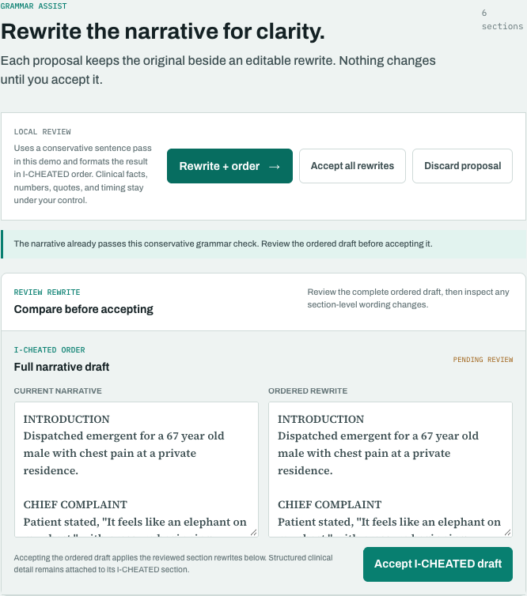
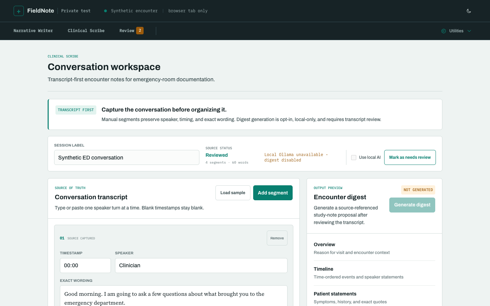
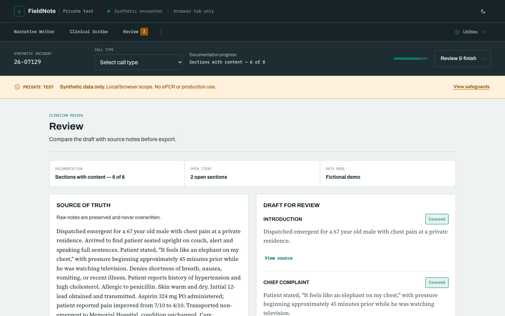
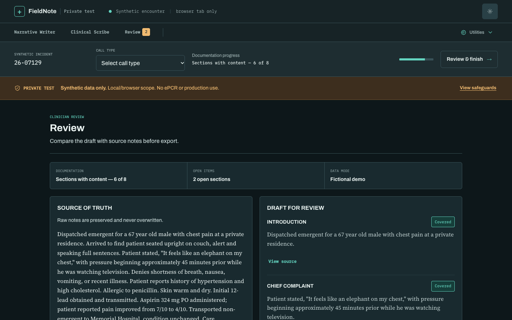

<div align="center">

# FieldNote

**AI-assisted EMS narrative documentation, where the clinician stays in control.**

Write the call as you remember it. FieldNote sorts it into a complete, source-linked I-CHEATED narrative and shows you every change before it lands in the record.

[](https://github.com/realjeffreyau/FieldNote/actions/workflows/ci.yml)


-0f766e)


[Overview](#overview) · [Product tour](#product-tour) · [Privacy by design](#privacy-by-design) · [Quick start](#quick-start) · [Quality gates](#quality-gates) · [Roadmap](#roadmap)

<br />



</div>

---

## Overview

Patient care reports take a long time to write, and much of that time goes to restructuring what the medic already knows into the format the chart requires. FieldNote does that restructuring and leaves the clinical judgment to the medic.

| | |
|---|---|
| **Capture in your own words** | Freeform notes, guided questions, or dictation. Whatever matches how a crew actually works. |
| **Structure without rewriting facts** | Notes are organized into the 8 I-CHEATED sections, and each sentence links back to the raw note it came from. |
| **A human approves every change** | AI and rules output arrives as a *proposal*. Nothing enters the narrative until the clinician accepts it. |
| **Private by default** | No cloud AI, no accounts, no database. The optional model runs on the same machine over loopback. |

> [!IMPORTANT]
> FieldNote is a **private synthetic-data prototype**. It is not connected to any ePCR, is not HIPAA-certified, and must never receive real patient information. See [Project boundaries](#project-boundaries).

## Product tour

### 1. Capture the call, then organize it

Medics type or dictate the call in whatever order they remember it. **Organize details** splits the notes into proposed I-CHEATED sections. Each proposal can be accepted, edited, or discarded, and the raw notes are never overwritten.

<table>
  <tr>
    <td width="58%"></td>
    <td width="42%"></td>
  </tr>
  <tr>
    <td align="center"><sub>Capture mode, with the live narrative and completeness tracker</sub></td>
    <td align="center"><sub>Per-section proposals waiting for clinician review</sub></td>
  </tr>
</table>

### 2. Fill gaps with guided questions

Guided mode asks for one chart detail at a time. Quick-detail chips speed up common entries, and the I-CHEATED rail shows which sections are covered and which are still open.



### 3. Conservative Grammar Assist

Grammar Assist proposes a clarity rewrite and shows the full draft in I-CHEATED order next to the current narrative. Clinical facts, numbers, quotes, and times are left as written. The original text stays in place until the clinician accepts the rewrite.

<p align="center">
  
</p>

### 4. Clinical Scribe: transcript first

A separate workspace for emergency-department encounters. It captures editable speaker and timestamp segments, marks the transcript as reviewed, and only then allows a local, opt-in **encounter digest** whose statements reference back to the transcript.



### 5. Review before export, in light or night mode

The Review screen puts the untouched source notes next to the draft, section by section, with coverage status and open items. Night mode is available for low-light environments such as the back of an ambulance.

<table>
  <tr>
    <td width="50%"></td>
    <td width="50%"></td>
  </tr>
</table>

## Privacy by design

```text
┌──────────────┐   same-origin    ┌──────────────┐   127.0.0.1 only   ┌──────────────┐
│   Browser    │ ───────────────▶ │  server.mjs  │ ─────────────────▶ │    Ollama    │
│ (tab storage)│ ◀─────────────── │  (loopback)  │ ◀───────────────── │  (optional)  │
└──────────────┘                  └──────────────┘                    └──────────────┘
      │
      └─ Without Ollama, organizing runs as deterministic in-browser rules.
         No narrative text leaves the browser.
```

- **Off by default:** the **Use local AI** box starts unchecked, so notes are never sent to a model by accident.
- **Source-verified output:** a model proposal is rejected if its source excerpts can't be found in the submitted notes, and the deterministic rules proposal is used instead.
- **Gated Scribe digest:** generation needs a reviewed transcript, explicit consent, and an available loopback model, and copy/download needs a second clinician review.
- **Hardened server:** strict CSP and security headers, no CORS, path-traversal protection, request size limits, and error responses that don't echo input.
- **Session-scoped drafts:** drafts survive an accidental refresh and are cleared when the tab closes.

See the [AI Model Card](docs/AI_MODEL_CARD.md) for the context layers and the controlled improvement loop.

## Quick start

Requires **Node.js 20+**. There are no runtime dependencies.

```bash
npm ci
npm start
```

Open **http://127.0.0.1:4173**, accept the synthetic-data boundary, and choose **Load sample call**.

<details>
<summary><b>Optional: enable the local Ollama model</b></summary>

<br />

The browser only talks to `server.mjs`, and the server only talks to Ollama on `127.0.0.1`. No API key is needed.

1. Install [Ollama for macOS](https://ollama.com/download) and open it once so the local service starts.
2. Pull a small instruction model:

   ```bash
   ollama pull qwen3:4b
   ```

3. Build the versioned FieldNote profile. This doesn't fine-tune the base model. It applies a reviewed EMS documentation policy and deterministic runtime settings:

   ```bash
   npm run ai:build-model
   ```

4. Start FieldNote with the profile:

   ```bash
   OLLAMA_MODEL=fieldnote-qwen3:4b npm start
   ```

5. Check **Use local AI**, load the sample call, and choose **Organize details**. The toolbar shows `Ollama · fieldnote-qwen3:4b` when the model is available. Otherwise it shows a rules-fallback status.
6. Run the synthetic live evaluation:

   ```bash
   AI_EVAL_URL=http://127.0.0.1:4173 npm run ai:eval:live
   ```

To verify the service separately, run `curl http://127.0.0.1:11434/api/tags`.

`ALLOW_NETWORK=true` and `ALLOW_REMOTE_OLLAMA=true` are development opt-ins, not production security controls. Never use them with PHI without an agency architecture, approved vendor agreements, and counsel review.

</details>

## Quality gates

Every push runs the full private release gate in [GitHub Actions](.github/workflows/ci.yml).

| Command | What it verifies |
|---|---|
| `npm run check` | Syntax of the app, server, and every script |
| `npm run test:private` | Isolated startup, health, security headers, and readiness without Ollama |
| `npm run test:ai` | AI organize/compose regression against the response contracts |
| `npm run test:security` | Headers, no-CORS, encoded path traversal, opaque errors, request limits, and transcript review gating, run against a fake Ollama provider |
| `npm run agency:contract` | Deployment profiles and the content-free audit-event schema |
| `npm run agency:readiness` | Control register validation and current blockers (`:strict` is meant to fail until every control is verified) |
| **`npm run release:private`** | **All of the above** |

Run `npm audit --omit=dev --audit-level=moderate` and `git diff --check` separately for dependency and worktree state. The manual test script is in [Private Synthetic Testing](docs/PRIVATE_TESTING.md).

## Project boundaries

| ✅ Allowed in this private test | ⛔ Not allowed |
|---|---|
| Fictional cases | Real patient information |
| De-identified training cases approved by the data owner | Operational use during patient care |
| UI and workflow evaluation | Submission to an ePCR |
| Usability feedback from EMS professionals on synthetic fixtures | Clinical, diagnostic, triage, treatment, or billing decisions |
| | Claims of HIPAA compliance |

This candidate is intentionally **not** agency-ready, HIPAA-ready, NEMSIS-ready, WCAG-certified, or production-ready.

## Roadmap

1. **Validate** the workflow with EMS clinicians using synthetic cases.
2. **Define** intended and prohibited uses with EMS clinical leadership and healthcare counsel.
3. **Harden:** authenticated agency tenants, encryption, audit logging, retention controls, and incident response.
4. **Host:** an agency-hosted model, or vendors willing to sign applicable BAAs.
5. **Extend:** validate the Scribe proposal, review, and export flow with EMS and ED clinicians.
6. **Pilot:** complete a security risk analysis and a private pilot before any real PHI is processed.

## Documentation

| Area | Documents |
|---|---|
| Product | [Capability overview](docs/FIELDNOTE_PRODUCT_CAPABILITY.md) · [Release scope](docs/RELEASE_SCOPE.md) |
| AI | [Model card](docs/AI_MODEL_CARD.md) · [Context changelog](docs/AI_CONTEXT_CHANGELOG.md) · [Organize contract](docs/ai-organize-contract.json) · [Compose contract](docs/ai-compose-document-contract.json) |
| Testing | [Private synthetic testing](docs/PRIVATE_TESTING.md) · [Release checklist](docs/PUBLIC_DEMO_RELEASE_CHECKLIST.md) |
| Project | [Contributing](CONTRIBUTING.md) · [Security policy](SECURITY.md) |
| Agency path | [Readiness](docs/AGENCY_READINESS.md) · [Pilot framework](docs/AGENCY_PILOT_FRAMEWORK.md) · [Pilot acceptance](docs/AGENCY_PILOT_ACCEPTANCE.md) · [Controls](docs/agency-controls.json) · [Deployment profiles](docs/agency-deployment-profiles.json) |

---

<div align="center">
<sub>Built for the people who write the report after the call. All data in this repository and its screenshots is synthetic.</sub>
</div>
